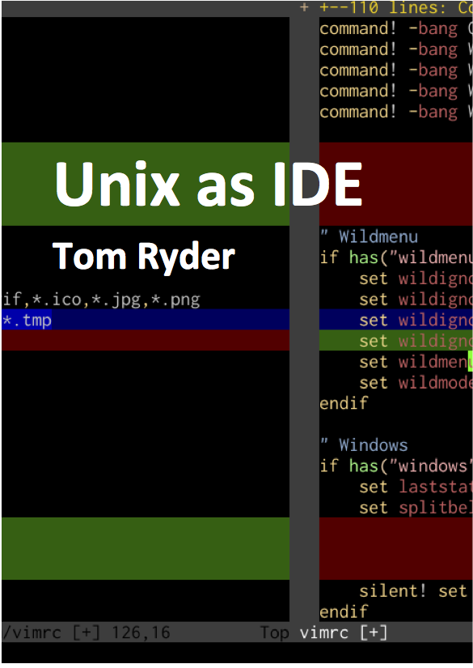

# Unix as IDE

The ebook version of the series of posts by Tom Ryder, originally posted on [his website](http://blog.sanctum.geek.nz/series/unix-as-ide/).

Built with the help of [Beautiful Soup](http://www.crummy.com/software/BeautifulSoup/), [Pandoc](http://pandoc.org/), [kindlegen](https://www.amazon.com/gp/feature.html?docId=1000765211), and [Vim](http://www.vim.org/).

This book is also available on [Unglue.it](https://unglue.it/work/194054/).

Cover by [Eric Hellman](https://github.com/eshellman).

## License

© Tom Ryder, CC BY-NC-SA
